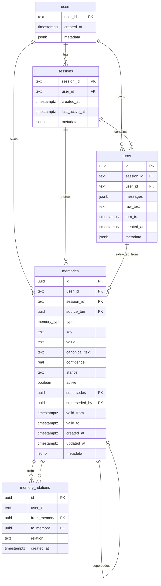
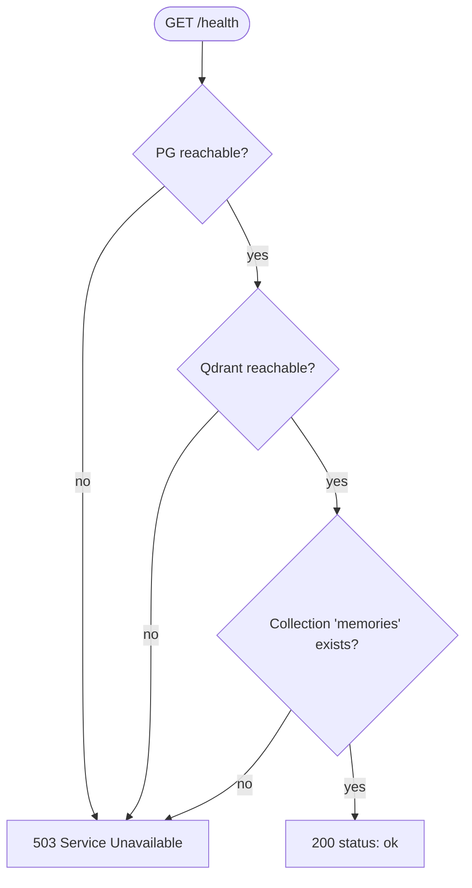
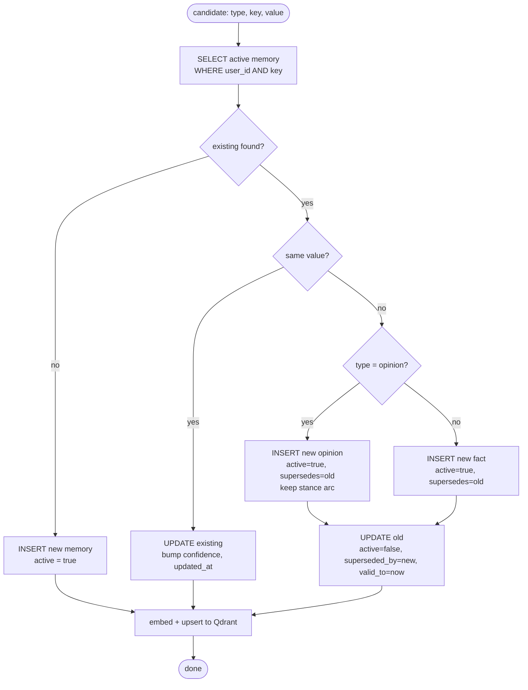
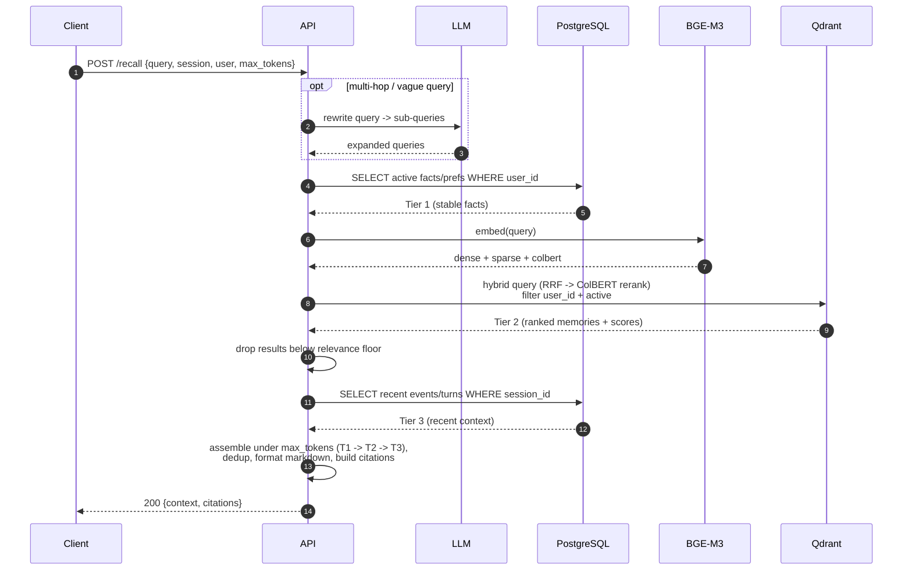
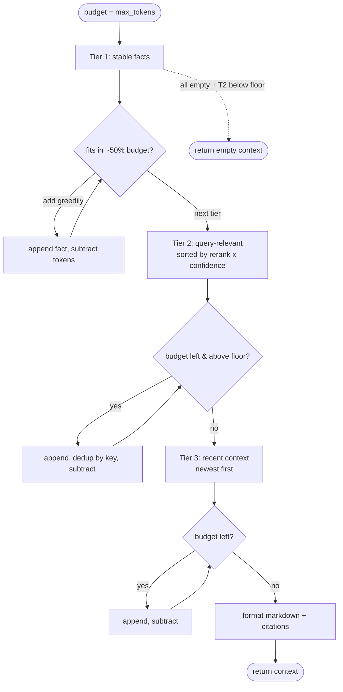
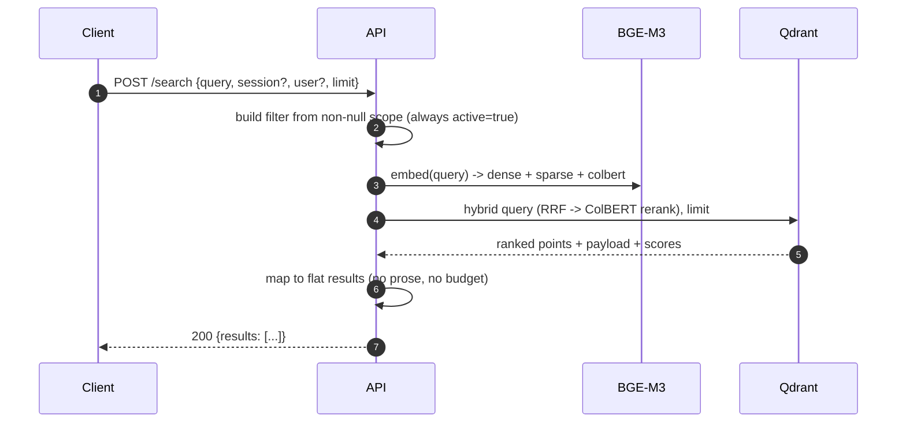
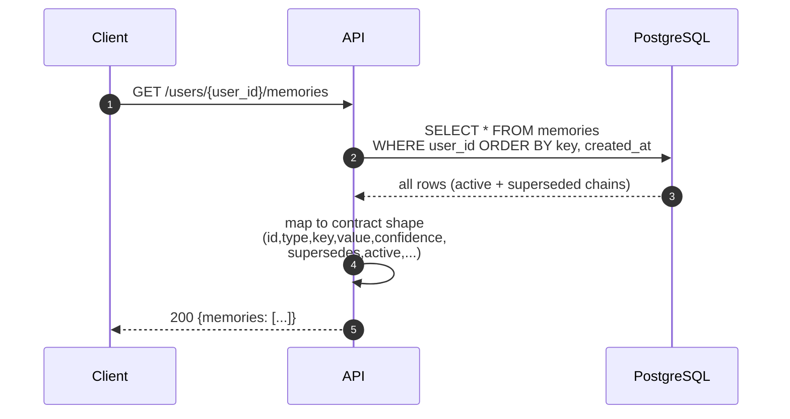
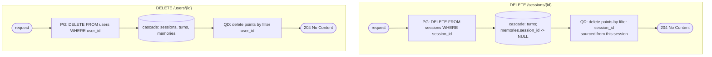
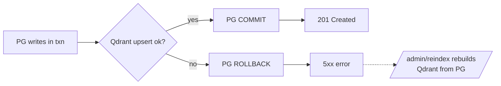

# Memory Service — DB Schema & Diagrams

> Companion to the design document. Detailed schema reference + Mermaid diagrams.
> **Importing into draw.io:** `Arrange → Insert → Advanced → Mermaid`, then paste a single fenced block at a time.

---

## Part 1 — Detailed database schema

PostgreSQL 16. Five objects: one enum + four tables (`users`, `sessions`, `turns`, `memories`) and one optional table (`memory_relations`).

Conventions used below:
- **PK** = primary key, **FK** = foreign key, **UQ** = unique, **IX** = indexed.
- All timestamps are `TIMESTAMPTZ` (UTC, timezone-aware).
- `metadata` columns are `JSONB` for schema-flexible extras (always default `'{}'`).

---

### Enum: `memory_type`

```sql
CREATE TYPE memory_type AS ENUM ('fact', 'preference', 'opinion', 'event');
```

| Value | Meaning | Mutability | Recall tier |
|---|---|---|---|
| `fact` | Objective, verifiable state about the user (employer, city, pet). | Supersedable (one active per key). | Tier 1 (stable) |
| `preference` | Stable like/dislike or working style ("prefers concise answers", "vegetarian"). | Supersedable (one active per key). | Tier 1 (stable) |
| `opinion` | Subjective stance that can drift over time ("loves TypeScript"). | Versioned arc (chain, latest active). | Tier 1/2 |
| `event` | Time-bound occurrence ("debugged React perf on 2025-03-10"). | Append-only, never superseded. | Tier 3 (recent) |

Using an enum (not free text) keeps `type` constrained and lets the recall layer branch on it cheaply.

---

### Table: `users`

The top-level owner of all memory. Created lazily on first turn (idempotent upsert).

| Column | Type | Null | Default | Key | Description |
|---|---|---|---|---|---|
| `user_id` | `TEXT` | NO | — | PK | Caller-supplied stable user identifier. |
| `created_at` | `TIMESTAMPTZ` | NO | `now()` | — | First time we saw this user. |
| `metadata` | `JSONB` | NO | `'{}'` | — | Arbitrary extras (locale, plan, etc.). |

**Indexes:** PK on `user_id`.
**Cascade:** deleting a user cascades to its sessions, turns, and memories (see FKs below).
**Why TEXT PK:** the caller owns the namespace; we don't mint our own user IDs.

---

### Table: `sessions`

A conversation thread. Many sessions per user. Turns belong to a session; user-scoped memories may outlive any single session.

| Column | Type | Null | Default | Key | Description |
|---|---|---|---|---|---|
| `session_id` | `TEXT` | NO | — | PK | Caller-supplied session identifier. |
| `user_id` | `TEXT` | YES | — | FK→`users` (ON DELETE CASCADE) | Owner; nullable for anonymous sessions. |
| `created_at` | `TIMESTAMPTZ` | NO | `now()` | — | Session start. |
| `last_active_at` | `TIMESTAMPTZ` | NO | `now()` | — | Updated on each turn; used for recency. |
| `metadata` | `JSONB` | NO | `'{}'` | — | Channel, client, etc. |

**Indexes:** PK on `session_id`; `IX idx_sessions_user (user_id)`.
**Why `user_id` nullable:** the contract allows `user_id: null`. Session still works; such memories are session-scoped only.

---

### Table: `turns`

The raw, immutable conversation record — the audit trail. One row per `POST /turns`. This is what extraction reads and what `citations` point back to.

| Column | Type | Null | Default | Key | Description |
|---|---|---|---|---|---|
| `id` | `UUID` | NO | `gen_random_uuid()` | PK | Turn id; returned to the client and used in citations. |
| `session_id` | `TEXT` | NO | — | FK→`sessions` (CASCADE) | Owning session. |
| `user_id` | `TEXT` | YES | — | FK→`users` (CASCADE) | Owning user (nullable). |
| `messages` | `JSONB` | NO | — | — | Verbatim messages array (role/content/name) as received. |
| `raw_text` | `TEXT` | NO | — | — | Flattened `"role: content"` text used for extraction + display. |
| `turn_ts` | `TIMESTAMPTZ` | NO | — | — | Timestamp from the request body (conversation time). |
| `created_at` | `TIMESTAMPTZ` | NO | `now()` | — | Ingestion time (may differ from `turn_ts`). |
| `metadata` | `JSONB` | NO | `'{}'` | — | Request metadata passthrough. |

**Indexes:** PK on `id`; `IX idx_turns_session (session_id)`; `IX idx_turns_user_ts (user_id, turn_ts DESC)` — powers Tier-3 "recent turns for this user/session".
**Why keep both `messages` and `raw_text`:** `messages` preserves structure for audit/reprocessing; `raw_text` is the cheap-to-read form for extraction and snippets.
**Why store turns even though we extract memories:** provenance (`memories.source_turn`), citations, and the ability to re-run extraction later.

---

### Table: `memories` — the core

Structured knowledge derived from turns. Append-only except for `active` / `superseded_by` / `updated_at`. History is deactivated, never deleted.

| Column | Type | Null | Default | Key | Description |
|---|---|---|---|---|---|
| `id` | `UUID` | NO | `gen_random_uuid()` | PK | Memory id (= Qdrant point id). |
| `user_id` | `TEXT` | YES | — | FK→`users` (CASCADE) | Owner; memories are user-scoped. |
| `session_id` | `TEXT` | YES | — | FK→`sessions` (ON DELETE SET NULL) | Provenance session; nulled if session deleted but fact kept. |
| `source_turn` | `UUID` | YES | — | FK→`turns` (CASCADE) | The turn this was extracted from. |
| `type` | `memory_type` | NO | — | — | `fact` / `preference` / `opinion` / `event`. |
| `key` | `TEXT` | NO | — | — | **Normalized topic** (`employment.employer`, `location.city`, `pet.name`). The contradiction-detection primitive. |
| `value` | `TEXT` | NO | — | — | Concrete value (`Notion`, `Berlin`, `Biscuit`). |
| `canonical_text` | `TEXT` | NO | — | — | Clean NL statement; embedded into Qdrant and shown in recall. |
| `confidence` | `REAL` | NO | `0.7` | CHECK 0–1 | Extraction confidence; tie-breaker in ranking. |
| `stance` | `TEXT` | YES | — | — | For opinions: `positive`/`negative`/`mixed`/`neutral`. |
| `active` | `BOOLEAN` | NO | `TRUE` | — | Current truth flag. `FALSE` = superseded history. |
| `supersedes` | `UUID` | YES | — | FK→`memories` (SET NULL) | The older memory this one replaces. |
| `superseded_by` | `UUID` | YES | — | FK→`memories` (SET NULL) | The newer memory that replaced this one. |
| `valid_from` | `TIMESTAMPTZ` | NO | `now()` | — | When this fact became true (temporal lower bound). |
| `valid_to` | `TIMESTAMPTZ` | YES | — | — | When it stopped being true (set on supersession). |
| `created_at` | `TIMESTAMPTZ` | NO | `now()` | — | Row creation. |
| `updated_at` | `TIMESTAMPTZ` | NO | `now()` | — | Last touch (e.g. confidence bump on restate). |
| `metadata` | `JSONB` | NO | `'{}'` | — | Flags like `{"correction": true}`. |

**Indexes:**
- PK on `id`.
- `IX idx_mem_user_active (user_id, active)` — Tier-1 fact fetch.
- `IX idx_mem_user_key (user_id, key)` — reconciliation lookup.
- `IX idx_mem_source_turn (source_turn)` — provenance / cascade.
- **`UQ uniq_active_scalar_fact (user_id, key) WHERE active AND type IN ('fact','preference')`** — partial unique index: at most one active scalar fact per key. This *physically enforces* fact evolution integrity, even if app logic has a bug.

**Self-reference:** `supersedes` / `superseded_by` form a doubly-linked chain so the supersession history is walkable in both directions and fully visible via `GET /users/{id}/memories`.

**Why a normalized `key`:** it turns "is this a contradiction?" into `WHERE user_id=? AND key=? AND active` instead of a fuzzy semantic comparison. It's the single most important schema decision for fact evolution.

---

### Table: `memory_relations` (optional / future)

Explicit entity links for advanced multi-hop. **Not required for v1** — multi-hop within one user is solved by retrieving multiple active facts and letting the recall assembler connect them.

| Column | Type | Null | Default | Key | Description |
|---|---|---|---|---|---|
| `id` | `UUID` | NO | `gen_random_uuid()` | PK | — |
| `user_id` | `TEXT` | NO | — | — | Denormalized for fast scoping. |
| `from_memory` | `UUID` | NO | — | FK→`memories` (CASCADE) | Source memory. |
| `to_memory` | `UUID` | NO | — | FK→`memories` (CASCADE) | Target memory. |
| `relation` | `TEXT` | NO | — | — | `same_entity` / `about` / `co_occurs`. |
| `created_at` | `TIMESTAMPTZ` | NO | `now()` | — | — |

---

### Relationship summary

| Relationship | Cardinality | On delete |
|---|---|---|
| `users → sessions` | 1 : N | CASCADE |
| `users → turns` | 1 : N | CASCADE |
| `users → memories` | 1 : N | CASCADE |
| `sessions → turns` | 1 : N | CASCADE |
| `sessions → memories` | 1 : N | SET NULL (keep cross-session facts) |
| `turns → memories` | 1 : N | CASCADE |
| `memories → memories` (supersedes) | 1 : 0..1 | SET NULL |
| `memories → memory_relations` | 1 : N | CASCADE |

---

## Part 2 — ER diagram (Mermaid → draw.io)

Paste this single block into draw.io's Mermaid importer.



---

## Part 3 — Per-endpoint logic diagrams (Mermaid)

Participants used in sequence diagrams: **Client**, **API**, **PG** (PostgreSQL), **LLM** (extraction), **M3** (BGE-M3 embeddings), **QD** (Qdrant).

---

### 3.1 `GET /health`



---

### 3.2 `POST /turns` — write + extract (synchronous)

```mermaid
sequenceDiagram
    autonumber
    participant C as Client
    participant API
    participant PG as PostgreSQL
    participant LLM
    participant M3 as BGE-M3
    participant QD as Qdrant

    C->>API: POST /turns {session, user, messages, ts}
    API->>API: validate body (else 400)
    API->>PG: UPSERT users, sessions (idempotent)
    API->>API: flatten messages -> raw_text
    API->>PG: INSERT turns -> turn_id
    Note over PG: turn is durable now,<br/>even if extraction fails

    API->>PG: SELECT active memories WHERE user_id
    PG-->>API: known_state (current facts)
    API->>LLM: extract(raw_text, known_state)
    LLM-->>API: [candidates: type,key,value,canonical,conf,op]

    loop per candidate (single PG txn)
        API->>PG: SELECT active mem by (user_id, key)
        alt new fact
            API->>PG: INSERT memory (active=true)
        else same value restated
            API->>PG: UPDATE confidence, updated_at
        else contradiction / correction
            API->>PG: INSERT new (active=true, supersedes=old)
            API->>PG: UPDATE old (active=false, superseded_by=new)
        end
        API->>M3: embed(canonical_text)
        M3-->>API: dense + sparse + colbert
        API->>QD: upsert point(active=true); patch old point(active=false)
    end

    API->>PG: COMMIT
    API-->>C: 201 {id: turn_id}
```

---

### 3.3 Reconciliation / fact-evolution decision (the loop body above)



---

### 3.4 `POST /recall` — 3-tier assembled context (primary signal)



---

### 3.5 Recall budget assembly (token triage)



---

### 3.6 `POST /search` — structured tool-call search



---

### 3.7 `GET /users/{user_id}/memories` — inspection



---

### 3.8 `DELETE /sessions/{session_id}` and `DELETE /users/{user_id}`



---

### 3.9 Consistency guarantee (PG ↔ Qdrant on `/turns`)



Qdrant is written inside the request, before the response. A Qdrant failure rolls back Postgres, so the two stores never silently diverge; `/admin/reindex` can rebuild the index from the source of truth at any time.
